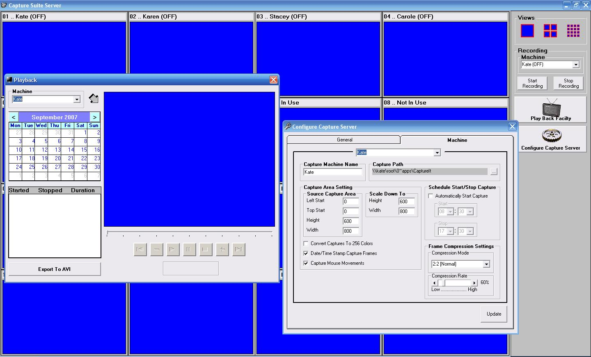



## Multiple Client/Server Screen Capture

### Description

Capture screens shots from upto 16 remote computers via the network. The client side application just needs to be running on the machine. The server is configured to point to this computer. Screens shots are capture once every seconds. Each screen shot can have a data/time stamp imprinted onto the image, also the image can be reduced in size, also mouse movements can be captured. The image is then converted to a JPG and saved. The server then polls the image and pads it into a custom play file. These files can be converted to AVI format at a later date. Now I know what you are saying, why not use winsock control, well 16 sockets would be hard to managed, plus I've found that this many sockets can be resource hungry and that they do not always work asynchronously.
 
### More Info
 

             |
---                |---
**Submitted On**   |2007-08-15 18:54:22
**By**             |[Hydro\.H20](https://github.com/Planet-Source-Code/PSCIndex/blob/master/ByAuthor/hydro-h20.md)
**Level**          |Intermediate
**User Rating**    |3.8 (15 globes from 4 users)
**Compatibility**  |VB 5\.0, VB 6\.0
**Category**       |[Complete Applications](https://github.com/Planet-Source-Code/PSCIndex/blob/master/ByCategory/complete-applications__1-27.md)
**World**          |[Visual Basic](https://github.com/Planet-Source-Code/PSCIndex/blob/master/ByWorld/visual-basic.md)
**Archive File**   |[Multiple\_C208148912007\.zip](https://github.com/Planet-Source-Code/hydro-h20-multiple-client-server-screen-capture__1-69237/archive/master.zip)

